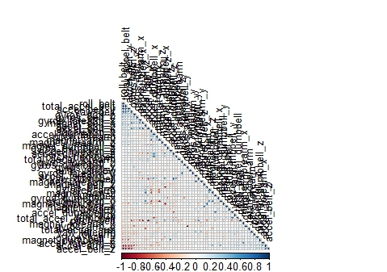
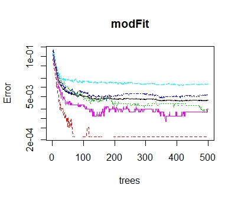
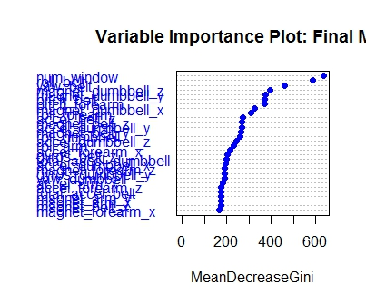

<!-- saved from url=(0111)file:///D:/umesh/MISC/coursera/Practical%20Machine%20Learning/projects/PracticalMachineLearing/ExerciseHTML.htm -->
<html xmlns:v="urn:schemas-microsoft-com:vml" xmlns:o="urn:schemas-microsoft-com:office:office" xmlns:w="urn:schemas-microsoft-com:office:word" xmlns:m="http://schemas.microsoft.com/office/2004/12/omml" xmlns="http://www.w3.org/TR/REC-html40"><head><meta http-equiv="Content-Type" content="text/html; charset=windows-1252">

<meta name="ProgId" content="Word.Document">
<meta name="Generator" content="Microsoft Word 14">
<meta name="Originator" content="Microsoft Word 14">
<link rel="File-List" href="file:///D:/umesh/MISC/coursera/Practical%20Machine%20Learning/projects/PracticalMachineLearing/ExerciseHTML_files/filelist.xml">
<link rel="Edit-Time-Data" href="file:///D:/umesh/MISC/coursera/Practical%20Machine%20Learning/projects/PracticalMachineLearing/ExerciseHTML_files/editdata.mso">
<!--[if !mso]>

<![endif]--><!--[if gte mso 9]><xml>
 <o:DocumentProperties>
  <o:Author>user</o:Author>
  <o:Template>Normal</o:Template>
  <o:LastAuthor>user</o:LastAuthor>
  <o:Revision>2</o:Revision>
  <o:TotalTime>2896</o:TotalTime>
  <o:Created>2015-03-20T00:27:00Z</o:Created>
  <o:LastSaved>2015-03-20T00:27:00Z</o:LastSaved>
  <o:Pages>5</o:Pages>
  <o:Words>753</o:Words>
  <o:Characters>4296</o:Characters>
  <o:Lines>35</o:Lines>
  <o:Paragraphs>10</o:Paragraphs>
  <o:CharactersWithSpaces>5039</o:CharactersWithSpaces>
  <o:Version>14.00</o:Version>
 </o:DocumentProperties>
 <o:OfficeDocumentSettings>
  <o:AllowPNG/>
 </o:OfficeDocumentSettings>
</xml><![endif]-->
<link rel="themeData" href="file:///D:/umesh/MISC/coursera/Practical%20Machine%20Learning/projects/PracticalMachineLearing/ExerciseHTML_files/themedata.thmx">
<link rel="colorSchemeMapping" href="file:///D:/umesh/MISC/coursera/Practical%20Machine%20Learning/projects/PracticalMachineLearing/ExerciseHTML_files/colorschememapping.xml">
<!--[if gte mso 9]><xml>
 <w:WordDocument>
  <w:SpellingState>Clean</w:SpellingState>
  <w:GrammarState>Clean</w:GrammarState>
  <w:TrackMoves>false</w:TrackMoves>
  <w:TrackFormatting/>
  <w:PunctuationKerning/>
  <w:ValidateAgainstSchemas/>
  <w:SaveIfXMLInvalid>false</w:SaveIfXMLInvalid>
  <w:IgnoreMixedContent>false</w:IgnoreMixedContent>
  <w:AlwaysShowPlaceholderText>false</w:AlwaysShowPlaceholderText>
  <w:DoNotPromoteQF/>
  <w:LidThemeOther>EN-IN</w:LidThemeOther>
  <w:LidThemeAsian>X-NONE</w:LidThemeAsian>
  <w:LidThemeComplexScript>X-NONE</w:LidThemeComplexScript>
  <w:Compatibility>
   <w:BreakWrappedTables/>
   <w:SnapToGridInCell/>
   <w:WrapTextWithPunct/>
   <w:UseAsianBreakRules/>
   <w:DontGrowAutofit/>
   <w:SplitPgBreakAndParaMark/>
   <w:EnableOpenTypeKerning/>
   <w:DontFlipMirrorIndents/>
   <w:OverrideTableStyleHps/>
  </w:Compatibility>
  <m:mathPr>
   <m:mathFont m:val="Cambria Math"/>
   <m:brkBin m:val="before"/>
   <m:brkBinSub m:val="&#45;-"/>
   <m:smallFrac m:val="off"/>
   <m:dispDef/>
   <m:lMargin m:val="0"/>
   <m:rMargin m:val="0"/>
   <m:defJc m:val="centerGroup"/>
   <m:wrapIndent m:val="1440"/>
   <m:intLim m:val="subSup"/>
   <m:naryLim m:val="undOvr"/>
  </m:mathPr></w:WordDocument>
</xml><![endif]--><!--[if gte mso 9]><xml>
 <w:LatentStyles DefLockedState="false" DefUnhideWhenUsed="true"
  DefSemiHidden="true" DefQFormat="false" DefPriority="99"
  LatentStyleCount="267">
  <w:LsdException Locked="false" Priority="0" SemiHidden="false"
   UnhideWhenUsed="false" QFormat="true" Name="Normal"/>
  <w:LsdException Locked="false" Priority="9" SemiHidden="false"
   UnhideWhenUsed="false" QFormat="true" Name="heading 1"/>
  <w:LsdException Locked="false" Priority="9" QFormat="true" Name="heading 2"/>
  <w:LsdException Locked="false" Priority="9" QFormat="true" Name="heading 3"/>
  <w:LsdException Locked="false" Priority="9" QFormat="true" Name="heading 4"/>
  <w:LsdException Locked="false" Priority="9" QFormat="true" Name="heading 5"/>
  <w:LsdException Locked="false" Priority="9" QFormat="true" Name="heading 6"/>
  <w:LsdException Locked="false" Priority="9" QFormat="true" Name="heading 7"/>
  <w:LsdException Locked="false" Priority="9" QFormat="true" Name="heading 8"/>
  <w:LsdException Locked="false" Priority="9" QFormat="true" Name="heading 9"/>
  <w:LsdException Locked="false" Priority="39" Name="toc 1"/>
  <w:LsdException Locked="false" Priority="39" Name="toc 2"/>
  <w:LsdException Locked="false" Priority="39" Name="toc 3"/>
  <w:LsdException Locked="false" Priority="39" Name="toc 4"/>
  <w:LsdException Locked="false" Priority="39" Name="toc 5"/>
  <w:LsdException Locked="false" Priority="39" Name="toc 6"/>
  <w:LsdException Locked="false" Priority="39" Name="toc 7"/>
  <w:LsdException Locked="false" Priority="39" Name="toc 8"/>
  <w:LsdException Locked="false" Priority="39" Name="toc 9"/>
  <w:LsdException Locked="false" Priority="35" QFormat="true" Name="caption"/>
  <w:LsdException Locked="false" Priority="10" SemiHidden="false"
   UnhideWhenUsed="false" QFormat="true" Name="Title"/>
  <w:LsdException Locked="false" Priority="1" Name="Default Paragraph Font"/>
  <w:LsdException Locked="false" Priority="11" SemiHidden="false"
   UnhideWhenUsed="false" QFormat="true" Name="Subtitle"/>
  <w:LsdException Locked="false" Priority="22" SemiHidden="false"
   UnhideWhenUsed="false" QFormat="true" Name="Strong"/>
  <w:LsdException Locked="false" Priority="20" SemiHidden="false"
   UnhideWhenUsed="false" QFormat="true" Name="Emphasis"/>
  <w:LsdException Locked="false" Priority="59" SemiHidden="false"
   UnhideWhenUsed="false" Name="Table Grid"/>
  <w:LsdException Locked="false" UnhideWhenUsed="false" Name="Placeholder Text"/>
  <w:LsdException Locked="false" Priority="1" SemiHidden="false"
   UnhideWhenUsed="false" QFormat="true" Name="No Spacing"/>
  <w:LsdException Locked="false" Priority="60" SemiHidden="false"
   UnhideWhenUsed="false" Name="Light Shading"/>
  <w:LsdException Locked="false" Priority="61" SemiHidden="false"
   UnhideWhenUsed="false" Name="Light List"/>
  <w:LsdException Locked="false" Priority="62" SemiHidden="false"
   UnhideWhenUsed="false" Name="Light Grid"/>
  <w:LsdException Locked="false" Priority="63" SemiHidden="false"
   UnhideWhenUsed="false" Name="Medium Shading 1"/>
  <w:LsdException Locked="false" Priority="64" SemiHidden="false"
   UnhideWhenUsed="false" Name="Medium Shading 2"/>
  <w:LsdException Locked="false" Priority="65" SemiHidden="false"
   UnhideWhenUsed="false" Name="Medium List 1"/>
  <w:LsdException Locked="false" Priority="66" SemiHidden="false"
   UnhideWhenUsed="false" Name="Medium List 2"/>
  <w:LsdException Locked="false" Priority="67" SemiHidden="false"
   UnhideWhenUsed="false" Name="Medium Grid 1"/>
  <w:LsdException Locked="false" Priority="68" SemiHidden="false"
   UnhideWhenUsed="false" Name="Medium Grid 2"/>
  <w:LsdException Locked="false" Priority="69" SemiHidden="false"
   UnhideWhenUsed="false" Name="Medium Grid 3"/>
  <w:LsdException Locked="false" Priority="70" SemiHidden="false"
   UnhideWhenUsed="false" Name="Dark List"/>
  <w:LsdException Locked="false" Priority="71" SemiHidden="false"
   UnhideWhenUsed="false" Name="Colorful Shading"/>
  <w:LsdException Locked="false" Priority="72" SemiHidden="false"
   UnhideWhenUsed="false" Name="Colorful List"/>
  <w:LsdException Locked="false" Priority="73" SemiHidden="false"
   UnhideWhenUsed="false" Name="Colorful Grid"/>
  <w:LsdException Locked="false" Priority="60" SemiHidden="false"
   UnhideWhenUsed="false" Name="Light Shading Accent 1"/>
  <w:LsdException Locked="false" Priority="61" SemiHidden="false"
   UnhideWhenUsed="false" Name="Light List Accent 1"/>
  <w:LsdException Locked="false" Priority="62" SemiHidden="false"
   UnhideWhenUsed="false" Name="Light Grid Accent 1"/>
  <w:LsdException Locked="false" Priority="63" SemiHidden="false"
   UnhideWhenUsed="false" Name="Medium Shading 1 Accent 1"/>
  <w:LsdException Locked="false" Priority="64" SemiHidden="false"
   UnhideWhenUsed="false" Name="Medium Shading 2 Accent 1"/>
  <w:LsdException Locked="false" Priority="65" SemiHidden="false"
   UnhideWhenUsed="false" Name="Medium List 1 Accent 1"/>
  <w:LsdException Locked="false" UnhideWhenUsed="false" Name="Revision"/>
  <w:LsdException Locked="false" Priority="34" SemiHidden="false"
   UnhideWhenUsed="false" QFormat="true" Name="List Paragraph"/>
  <w:LsdException Locked="false" Priority="29" SemiHidden="false"
   UnhideWhenUsed="false" QFormat="true" Name="Quote"/>
  <w:LsdException Locked="false" Priority="30" SemiHidden="false"
   UnhideWhenUsed="false" QFormat="true" Name="Intense Quote"/>
  <w:LsdException Locked="false" Priority="66" SemiHidden="false"
   UnhideWhenUsed="false" Name="Medium List 2 Accent 1"/>
  <w:LsdException Locked="false" Priority="67" SemiHidden="false"
   UnhideWhenUsed="false" Name="Medium Grid 1 Accent 1"/>
  <w:LsdException Locked="false" Priority="68" SemiHidden="false"
   UnhideWhenUsed="false" Name="Medium Grid 2 Accent 1"/>
  <w:LsdException Locked="false" Priority="69" SemiHidden="false"
   UnhideWhenUsed="false" Name="Medium Grid 3 Accent 1"/>
  <w:LsdException Locked="false" Priority="70" SemiHidden="false"
   UnhideWhenUsed="false" Name="Dark List Accent 1"/>
  <w:LsdException Locked="false" Priority="71" SemiHidden="false"
   UnhideWhenUsed="false" Name="Colorful Shading Accent 1"/>
  <w:LsdException Locked="false" Priority="72" SemiHidden="false"
   UnhideWhenUsed="false" Name="Colorful List Accent 1"/>
  <w:LsdException Locked="false" Priority="73" SemiHidden="false"
   UnhideWhenUsed="false" Name="Colorful Grid Accent 1"/>
  <w:LsdException Locked="false" Priority="60" SemiHidden="false"
   UnhideWhenUsed="false" Name="Light Shading Accent 2"/>
  <w:LsdException Locked="false" Priority="61" SemiHidden="false"
   UnhideWhenUsed="false" Name="Light List Accent 2"/>
  <w:LsdException Locked="false" Priority="62" SemiHidden="false"
   UnhideWhenUsed="false" Name="Light Grid Accent 2"/>
  <w:LsdException Locked="false" Priority="63" SemiHidden="false"
   UnhideWhenUsed="false" Name="Medium Shading 1 Accent 2"/>
  <w:LsdException Locked="false" Priority="64" SemiHidden="false"
   UnhideWhenUsed="false" Name="Medium Shading 2 Accent 2"/>
  <w:LsdException Locked="false" Priority="65" SemiHidden="false"
   UnhideWhenUsed="false" Name="Medium List 1 Accent 2"/>
  <w:LsdException Locked="false" Priority="66" SemiHidden="false"
   UnhideWhenUsed="false" Name="Medium List 2 Accent 2"/>
  <w:LsdException Locked="false" Priority="67" SemiHidden="false"
   UnhideWhenUsed="false" Name="Medium Grid 1 Accent 2"/>
  <w:LsdException Locked="false" Priority="68" SemiHidden="false"
   UnhideWhenUsed="false" Name="Medium Grid 2 Accent 2"/>
  <w:LsdException Locked="false" Priority="69" SemiHidden="false"
   UnhideWhenUsed="false" Name="Medium Grid 3 Accent 2"/>
  <w:LsdException Locked="false" Priority="70" SemiHidden="false"
   UnhideWhenUsed="false" Name="Dark List Accent 2"/>
  <w:LsdException Locked="false" Priority="71" SemiHidden="false"
   UnhideWhenUsed="false" Name="Colorful Shading Accent 2"/>
  <w:LsdException Locked="false" Priority="72" SemiHidden="false"
   UnhideWhenUsed="false" Name="Colorful List Accent 2"/>
  <w:LsdException Locked="false" Priority="73" SemiHidden="false"
   UnhideWhenUsed="false" Name="Colorful Grid Accent 2"/>
  <w:LsdException Locked="false" Priority="60" SemiHidden="false"
   UnhideWhenUsed="false" Name="Light Shading Accent 3"/>
  <w:LsdException Locked="false" Priority="61" SemiHidden="false"
   UnhideWhenUsed="false" Name="Light List Accent 3"/>
  <w:LsdException Locked="false" Priority="62" SemiHidden="false"
   UnhideWhenUsed="false" Name="Light Grid Accent 3"/>
  <w:LsdException Locked="false" Priority="63" SemiHidden="false"
   UnhideWhenUsed="false" Name="Medium Shading 1 Accent 3"/>
  <w:LsdException Locked="false" Priority="64" SemiHidden="false"
   UnhideWhenUsed="false" Name="Medium Shading 2 Accent 3"/>
  <w:LsdException Locked="false" Priority="65" SemiHidden="false"
   UnhideWhenUsed="false" Name="Medium List 1 Accent 3"/>
  <w:LsdException Locked="false" Priority="66" SemiHidden="false"
   UnhideWhenUsed="false" Name="Medium List 2 Accent 3"/>
  <w:LsdException Locked="false" Priority="67" SemiHidden="false"
   UnhideWhenUsed="false" Name="Medium Grid 1 Accent 3"/>
  <w:LsdException Locked="false" Priority="68" SemiHidden="false"
   UnhideWhenUsed="false" Name="Medium Grid 2 Accent 3"/>
  <w:LsdException Locked="false" Priority="69" SemiHidden="false"
   UnhideWhenUsed="false" Name="Medium Grid 3 Accent 3"/>
  <w:LsdException Locked="false" Priority="70" SemiHidden="false"
   UnhideWhenUsed="false" Name="Dark List Accent 3"/>
  <w:LsdException Locked="false" Priority="71" SemiHidden="false"
   UnhideWhenUsed="false" Name="Colorful Shading Accent 3"/>
  <w:LsdException Locked="false" Priority="72" SemiHidden="false"
   UnhideWhenUsed="false" Name="Colorful List Accent 3"/>
  <w:LsdException Locked="false" Priority="73" SemiHidden="false"
   UnhideWhenUsed="false" Name="Colorful Grid Accent 3"/>
  <w:LsdException Locked="false" Priority="60" SemiHidden="false"
   UnhideWhenUsed="false" Name="Light Shading Accent 4"/>
  <w:LsdException Locked="false" Priority="61" SemiHidden="false"
   UnhideWhenUsed="false" Name="Light List Accent 4"/>
  <w:LsdException Locked="false" Priority="62" SemiHidden="false"
   UnhideWhenUsed="false" Name="Light Grid Accent 4"/>
  <w:LsdException Locked="false" Priority="63" SemiHidden="false"
   UnhideWhenUsed="false" Name="Medium Shading 1 Accent 4"/>
  <w:LsdException Locked="false" Priority="64" SemiHidden="false"
   UnhideWhenUsed="false" Name="Medium Shading 2 Accent 4"/>
  <w:LsdException Locked="false" Priority="65" SemiHidden="false"
   UnhideWhenUsed="false" Name="Medium List 1 Accent 4"/>
  <w:LsdException Locked="false" Priority="66" SemiHidden="false"
   UnhideWhenUsed="false" Name="Medium List 2 Accent 4"/>
  <w:LsdException Locked="false" Priority="67" SemiHidden="false"
   UnhideWhenUsed="false" Name="Medium Grid 1 Accent 4"/>
  <w:LsdException Locked="false" Priority="68" SemiHidden="false"
   UnhideWhenUsed="false" Name="Medium Grid 2 Accent 4"/>
  <w:LsdException Locked="false" Priority="69" SemiHidden="false"
   UnhideWhenUsed="false" Name="Medium Grid 3 Accent 4"/>
  <w:LsdException Locked="false" Priority="70" SemiHidden="false"
   UnhideWhenUsed="false" Name="Dark List Accent 4"/>
  <w:LsdException Locked="false" Priority="71" SemiHidden="false"
   UnhideWhenUsed="false" Name="Colorful Shading Accent 4"/>
  <w:LsdException Locked="false" Priority="72" SemiHidden="false"
   UnhideWhenUsed="false" Name="Colorful List Accent 4"/>
  <w:LsdException Locked="false" Priority="73" SemiHidden="false"
   UnhideWhenUsed="false" Name="Colorful Grid Accent 4"/>
  <w:LsdException Locked="false" Priority="60" SemiHidden="false"
   UnhideWhenUsed="false" Name="Light Shading Accent 5"/>
  <w:LsdException Locked="false" Priority="61" SemiHidden="false"
   UnhideWhenUsed="false" Name="Light List Accent 5"/>
  <w:LsdException Locked="false" Priority="62" SemiHidden="false"
   UnhideWhenUsed="false" Name="Light Grid Accent 5"/>
  <w:LsdException Locked="false" Priority="63" SemiHidden="false"
   UnhideWhenUsed="false" Name="Medium Shading 1 Accent 5"/>
  <w:LsdException Locked="false" Priority="64" SemiHidden="false"
   UnhideWhenUsed="false" Name="Medium Shading 2 Accent 5"/>
  <w:LsdException Locked="false" Priority="65" SemiHidden="false"
   UnhideWhenUsed="false" Name="Medium List 1 Accent 5"/>
  <w:LsdException Locked="false" Priority="66" SemiHidden="false"
   UnhideWhenUsed="false" Name="Medium List 2 Accent 5"/>
  <w:LsdException Locked="false" Priority="67" SemiHidden="false"
   UnhideWhenUsed="false" Name="Medium Grid 1 Accent 5"/>
  <w:LsdException Locked="false" Priority="68" SemiHidden="false"
   UnhideWhenUsed="false" Name="Medium Grid 2 Accent 5"/>
  <w:LsdException Locked="false" Priority="69" SemiHidden="false"
   UnhideWhenUsed="false" Name="Medium Grid 3 Accent 5"/>
  <w:LsdException Locked="false" Priority="70" SemiHidden="false"
   UnhideWhenUsed="false" Name="Dark List Accent 5"/>
  <w:LsdException Locked="false" Priority="71" SemiHidden="false"
   UnhideWhenUsed="false" Name="Colorful Shading Accent 5"/>
  <w:LsdException Locked="false" Priority="72" SemiHidden="false"
   UnhideWhenUsed="false" Name="Colorful List Accent 5"/>
  <w:LsdException Locked="false" Priority="73" SemiHidden="false"
   UnhideWhenUsed="false" Name="Colorful Grid Accent 5"/>
  <w:LsdException Locked="false" Priority="60" SemiHidden="false"
   UnhideWhenUsed="false" Name="Light Shading Accent 6"/>
  <w:LsdException Locked="false" Priority="61" SemiHidden="false"
   UnhideWhenUsed="false" Name="Light List Accent 6"/>
  <w:LsdException Locked="false" Priority="62" SemiHidden="false"
   UnhideWhenUsed="false" Name="Light Grid Accent 6"/>
  <w:LsdException Locked="false" Priority="63" SemiHidden="false"
   UnhideWhenUsed="false" Name="Medium Shading 1 Accent 6"/>
  <w:LsdException Locked="false" Priority="64" SemiHidden="false"
   UnhideWhenUsed="false" Name="Medium Shading 2 Accent 6"/>
  <w:LsdException Locked="false" Priority="65" SemiHidden="false"
   UnhideWhenUsed="false" Name="Medium List 1 Accent 6"/>
  <w:LsdException Locked="false" Priority="66" SemiHidden="false"
   UnhideWhenUsed="false" Name="Medium List 2 Accent 6"/>
  <w:LsdException Locked="false" Priority="67" SemiHidden="false"
   UnhideWhenUsed="false" Name="Medium Grid 1 Accent 6"/>
  <w:LsdException Locked="false" Priority="68" SemiHidden="false"
   UnhideWhenUsed="false" Name="Medium Grid 2 Accent 6"/>
  <w:LsdException Locked="false" Priority="69" SemiHidden="false"
   UnhideWhenUsed="false" Name="Medium Grid 3 Accent 6"/>
  <w:LsdException Locked="false" Priority="70" SemiHidden="false"
   UnhideWhenUsed="false" Name="Dark List Accent 6"/>
  <w:LsdException Locked="false" Priority="71" SemiHidden="false"
   UnhideWhenUsed="false" Name="Colorful Shading Accent 6"/>
  <w:LsdException Locked="false" Priority="72" SemiHidden="false"
   UnhideWhenUsed="false" Name="Colorful List Accent 6"/>
  <w:LsdException Locked="false" Priority="73" SemiHidden="false"
   UnhideWhenUsed="false" Name="Colorful Grid Accent 6"/>
  <w:LsdException Locked="false" Priority="19" SemiHidden="false"
   UnhideWhenUsed="false" QFormat="true" Name="Subtle Emphasis"/>
  <w:LsdException Locked="false" Priority="21" SemiHidden="false"
   UnhideWhenUsed="false" QFormat="true" Name="Intense Emphasis"/>
  <w:LsdException Locked="false" Priority="31" SemiHidden="false"
   UnhideWhenUsed="false" QFormat="true" Name="Subtle Reference"/>
  <w:LsdException Locked="false" Priority="32" SemiHidden="false"
   UnhideWhenUsed="false" QFormat="true" Name="Intense Reference"/>
  <w:LsdException Locked="false" Priority="33" SemiHidden="false"
   UnhideWhenUsed="false" QFormat="true" Name="Book Title"/>
  <w:LsdException Locked="false" Priority="37" Name="Bibliography"/>
  <w:LsdException Locked="false" Priority="39" QFormat="true" Name="TOC Heading"/>
 </w:LatentStyles>
</xml><![endif]-->

<!--[if gte mso 10]>

<![endif]--><!--[if gte mso 9]><xml>
 <o:shapedefaults v:ext="edit" spidmax="1026"/>
</xml><![endif]--><!--[if gte mso 9]><xml>
 <o:shapelayout v:ext="edit">
  <o:idmap v:ext="edit" data="1"/>
 </o:shapelayout></xml><![endif]-->
</head>

<body lang="EN-IN" link="blue" vlink="purple" style="tab-interval:36.0pt">

<b style="mso-bidi-font-weight:normal">Introduction<o:p></o:p></b>

Health conditions can be maintained/improved by exercise such as weight lifting. In
order to measure the health conditions through these exercises, various
measurements are evaluated/analysed by the data
collected by devices such as Jawbone Up, Nike FuelBand,
and Fitbit. In this project, data has been analysed
to find pattern in the behaviour of set of groups who have been doing a
particular set of activities. The aim of this report was to use data from
accelerometers placed on the belt, forearm, arm, and dumbell
of six participants to predict how well they were doing the exercise in terms
of the classification in the data.<o:p></o:p>

<b style="mso-bidi-font-weight:normal">Task<o:p></o:p></b>

The goal is to predict
the manner in which people did the exercise. This is the "classe" variable in the training data set.<b style="mso-bidi-font-weight:normal"><o:p></o:p></b>

<b style="mso-bidi-font-weight:normal">Steps involved in the analysis<o:p></o:p></b>

<!--[if !supportLists]-->1.&nbsp;&nbsp;&nbsp; <!--[endif]-->Understanding the task<o:p></o:p>

<!--[if !supportLists]-->2.&nbsp;&nbsp;&nbsp; <!--[endif]-->Downloading data<o:p></o:p>

<!--[if !supportLists]-->3.&nbsp;&nbsp;&nbsp; <!--[endif]-->Pre-processing<o:p></o:p>

<!--[if !supportLists]-->4.&nbsp;&nbsp;&nbsp; <!--[endif]-->Data Exploration and identifying the predictor variables<o:p></o:p>

<!--[if !supportLists]-->5.&nbsp;&nbsp;&nbsp; <!--[endif]-->Partitioning the data<o:p></o:p>

<!--[if !supportLists]-->6.&nbsp;&nbsp;&nbsp; <!--[endif]-->Choosing the algorithm<o:p></o:p>

<!--[if !supportLists]-->7.&nbsp;&nbsp;&nbsp; <!--[endif]-->Build the model<o:p></o:p>

<!--[if !supportLists]-->8.&nbsp;&nbsp;&nbsp; <!--[endif]-->Predict the unknown data<o:p></o:p>

<!--[if !supportLists]-->9.&nbsp;&nbsp;&nbsp; <!--[endif]-->Measure the performance<o:p></o:p>

<!--[if !supportLists]-->10.&nbsp; <!--[endif]-->Conclusion<o:p></o:p>

<b style="mso-bidi-font-weight:normal">Data<o:p></o:p></b>

The data is taken from the&nbsp;<a href="http://groupware.les.inf.puc-rio.br/har">Human Activity Recognition</a>&nbsp;programme at&nbsp;<a href="http://groupware.les.inf.puc-rio.br/">Groupware</a>.<o:p></o:p>

<b style="mso-bidi-font-weight:normal">Objective<o:p></o:p></b>

The goal is to predict
the manner in which people did the exercise. This is the "classe" variable in the training data set.<b style="mso-bidi-font-weight:normal"><o:p></o:p></b>

<b style="mso-bidi-font-weight:normal">Data Pre-Processing<o:p></o:p></b>

Data contains lots of NA values which would
create a lot of noise for the model. As a result, these NAs were removed from
the data set. The first eight columns that acted as identifiers for the
experiment were also removed. First, remove all the columns which has maximum
NAs, these columns will not help in our analysis anyway. Also remove the columns which does not make any sense for the predictions.<o:p></o:p>

Remove the columns with
all/maximum Blanks<o:p></o:p>

# remove
columns which contains maximum NAs<o:p></o:p>

raw_har[raw_har==""] &lt;- NA<o:p></o:p>

nonas &lt;- raw_har[, colSums(is.na(raw_har)) == 0]<o:p></o:p>

# Beacuse
of the above cleaning, number of variables has been reduced to 60<o:p></o:p>

names(nonas)<o:p></o:p>

nonas&lt;-nonas[,-c(1,2,3,4)]<o:p></o:p>

<b style="mso-bidi-font-weight:
normal">Data Partition<o:p></o:p></b>

Create data partition – training and cross
validation set from the train.csv file. This is required to measure the
performance of the model.<o:p></o:p>

# Create
data partition - test and train<o:p></o:p>

library(caret)<o:p></o:p>

inTrain &lt;- createDataPartition(y=raw_har$classe,p=0.7,list=FALSE)<o:p></o:p>

train&lt;-nonas[inTrain,]<o:p></o:p>

crossval&lt;-nonas[-inTrain,]<o:p></o:p>

dim(train)<o:p></o:p>

dim(crossval)<o:p></o:p>

<b style="mso-bidi-font-weight:
normal">Data Exploration<o:p></o:p></b>

Plot the correlation between different
variables to see how predictor variables are correlated. A correllation
plot was produced in order to see how strong the variables relationships are.<o:p></o:p>

<o:p>&nbsp;</o:p>

<!--[if gte vml 1]><v:shapetype
 id="_x0000_t75" coordsize="21600,21600" o:spt="75" o:preferrelative="t"
 path="m@4@5l@4@11@9@11@9@5xe" filled="f" stroked="f">
 <v:stroke joinstyle="miter"/>
 <v:formulas>
  <v:f eqn="if lineDrawn pixelLineWidth 0"/>
  <v:f eqn="sum @0 1 0"/>
  <v:f eqn="sum 0 0 @1"/>
  <v:f eqn="prod @2 1 2"/>
  <v:f eqn="prod @3 21600 pixelWidth"/>
  <v:f eqn="prod @3 21600 pixelHeight"/>
  <v:f eqn="sum @0 0 1"/>
  <v:f eqn="prod @6 1 2"/>
  <v:f eqn="prod @7 21600 pixelWidth"/>
  <v:f eqn="sum @8 21600 0"/>
  <v:f eqn="prod @7 21600 pixelHeight"/>
  <v:f eqn="sum @10 21600 0"/>
 </v:formulas>
 <v:path o:extrusionok="f" gradientshapeok="t" o:connecttype="rect"/>
 <o:lock v:ext="edit" aspectratio="t"/>
</v:shapetype><v:shape id="Picture_x0020_1" o:spid="_x0000_i1027" type="#_x0000_t75"
 alt="Description: D:\umesh\MISC\coursera\Practical Machine Learning\projects\corPlot.jpeg"
 style='width:364.5pt;height:256.5pt;visibility:visible;mso-wrap-style:square'>
 <v:imagedata src="ExerciseHTML_files/image001.jpg" o:title="corPlot"/>
</v:shape><![endif]--><!--[if !vml]--><!--[endif]--><o:p></o:p>

<o:p>&nbsp;</o:p>

<b style="mso-bidi-font-weight:
normal">Build the Model<o:p></o:p></b>

A random forest model was selected to predict
the classification because it has methods for balancing error in class
population unbalanced data sets. <o:p></o:p>

## Random Forest model to
predict the classe<o:p></o:p>

modFit&lt;-randomForest(classe ~.,
data=train, mtry=3)<o:p></o:p>

summary(modFit)<o:p></o:p>

plot(modFit,log="y")<o:p></o:p>

Plot the error.<o:p></o:p>

<!--[if gte vml 1]><v:shape
 id="Picture_x0020_2" o:spid="_x0000_i1026" type="#_x0000_t75" style='width:287.25pt;
 height:239.25pt;visibility:visible;mso-wrap-style:square'>
 <v:imagedata src="ExerciseHTML_files/image002.jpg" o:title=""/>
</v:shape><![endif]--><!--[if !vml]--><!--[endif]--><o:p></o:p>

<o:p>&nbsp;</o:p>

<!--[if gte vml 1]><v:shape
 id="Picture_x0020_3" o:spid="_x0000_i1025" type="#_x0000_t75" style='width:310.5pt;
 height:258pt;visibility:visible;mso-wrap-style:square'>
 <v:imagedata src="ExerciseHTML_files/image003.jpg" o:title=""/>
</v:shape><![endif]--><!--[if !vml]--><!--[endif]--><o:p></o:p>

The test data gave a prediction accuracy of
99.3%. This is as shown by the confusion matrix.<o:p></o:p>

Cross validation of 30% data in the train.csv
file<o:p></o:p>

predCrossValCar &lt;- predict(modCaret, crossval)<o:p></o:p>

confusionMatrix(crossval$classe, predCrossValCar)

<o:p>&nbsp;</o:p>

<table class="MsoNormalTable" border="0" cellspacing="0" cellpadding="0" width="555" style="width:416.25pt;mso-cellspacing:0cm;mso-yfti-tbllook:1184;mso-padding-alt:
 0cm 0cm 6.0pt 4.5pt">
 <tbody><tr style="mso-yfti-irow:0;mso-yfti-firstrow:yes">
  <td valign="top" style="padding:0cm 0cm 6.0pt 4.5pt">
  
&gt; confusionMatrix(crossval$classe,
  predCrossValCar)<o:p></o:p>

  
Confusion Matrix and Statistics<o:p></o:p>

  
<o:p>&nbsp;</o:p>

  
&nbsp;&nbsp;&nbsp;&nbsp;&nbsp;&nbsp;&nbsp;&nbsp;&nbsp; Reference<o:p></o:p>

  
Prediction&nbsp;&nbsp;&nbsp; A&nbsp;&nbsp;&nbsp; B&nbsp;&nbsp;&nbsp;
  C&nbsp;&nbsp;&nbsp; D&nbsp;&nbsp;&nbsp; E<o:p></o:p>

  
&nbsp;&nbsp;&nbsp;&nbsp;&nbsp;&nbsp;&nbsp;&nbsp; A 1674&nbsp;&nbsp;&nbsp; 0&nbsp;&nbsp;&nbsp;
  0&nbsp;&nbsp;&nbsp; 0&nbsp;&nbsp;&nbsp; 0<o:p></o:p>

  
&nbsp;&nbsp;&nbsp;&nbsp;&nbsp;&nbsp;&nbsp;&nbsp; B&nbsp;&nbsp;&nbsp; 1 1136&nbsp;&nbsp;&nbsp;
  2&nbsp;&nbsp;&nbsp; 0&nbsp;&nbsp;&nbsp; 0<o:p></o:p>

  
&nbsp;&nbsp;&nbsp;&nbsp;&nbsp;&nbsp; &nbsp;&nbsp;C&nbsp;&nbsp;&nbsp;
  0&nbsp;&nbsp;&nbsp; 6 1020&nbsp;&nbsp;&nbsp; 0&nbsp;&nbsp;&nbsp;
  0<o:p></o:p>

  
&nbsp;&nbsp;&nbsp;&nbsp;&nbsp;&nbsp;&nbsp;&nbsp; D&nbsp;&nbsp;&nbsp; 0&nbsp;&nbsp;&nbsp;
  0&nbsp;&nbsp;&nbsp; 6&nbsp; 958&nbsp;&nbsp;&nbsp;
  0<o:p></o:p>

  
&nbsp;&nbsp;&nbsp;&nbsp;&nbsp;&nbsp;&nbsp;&nbsp; E&nbsp;&nbsp;&nbsp; 0&nbsp;&nbsp;&nbsp;
  0&nbsp;&nbsp;&nbsp; 0&nbsp;&nbsp;&nbsp; 1 1081<o:p></o:p>

  
<o:p>&nbsp;</o:p>

  
Overall Statistics<o:p></o:p>

  
&nbsp;&nbsp;&nbsp;&nbsp;&nbsp;&nbsp;&nbsp;&nbsp;&nbsp;&nbsp;&nbsp;&nbsp;&nbsp;&nbsp;&nbsp;&nbsp;&nbsp;&nbsp;&nbsp;&nbsp;&nbsp;&nbsp;&nbsp;&nbsp;&nbsp;&nbsp;&nbsp;&nbsp;&nbsp;&nbsp;&nbsp;&nbsp;&nbsp;&nbsp;&nbsp;&nbsp;&nbsp;&nbsp;&nbsp;&nbsp;&nbsp; <o:p></o:p>

  
&nbsp;&nbsp;&nbsp;&nbsp;&nbsp;&nbsp;&nbsp;&nbsp;&nbsp;&nbsp;&nbsp;&nbsp;&nbsp;&nbsp; Accuracy :
  0.9973&nbsp;&nbsp;&nbsp;&nbsp;&nbsp;&nbsp;&nbsp;&nbsp;&nbsp; <o:p></o:p>

  
&nbsp;&nbsp;&nbsp;&nbsp;&nbsp;&nbsp;&nbsp;&nbsp;&nbsp;&nbsp;&nbsp;&nbsp;&nbsp;&nbsp;&nbsp;&nbsp; 95% CI :
  (0.9956, 0.9984)<o:p></o:p>

  
&nbsp;&nbsp;&nbsp; No Information Rate :
  0.2846&nbsp;&nbsp;&nbsp;&nbsp;&nbsp;&nbsp;&nbsp;&nbsp;&nbsp; <o:p></o:p>

  
&nbsp;&nbsp;&nbsp; P-Value [Acc
  &gt; NIR] : &lt; 2.2e-16&nbsp;&nbsp;&nbsp;&nbsp;&nbsp;&nbsp; <o:p></o:p>

  
&nbsp;&nbsp;&nbsp;&nbsp;&nbsp;&nbsp;&nbsp;&nbsp;&nbsp;&nbsp;&nbsp;&nbsp;&nbsp;&nbsp;&nbsp;&nbsp;&nbsp;&nbsp;&nbsp;&nbsp;&nbsp;&nbsp;&nbsp;&nbsp;&nbsp;&nbsp;&nbsp;&nbsp;&nbsp;&nbsp;&nbsp;&nbsp;&nbsp;&nbsp;&nbsp;&nbsp;&nbsp;&nbsp;&nbsp;&nbsp;&nbsp; <o:p></o:p>

  
&nbsp;&nbsp;&nbsp;&nbsp;&nbsp;&nbsp;&nbsp;&nbsp;&nbsp;&nbsp;&nbsp;&nbsp;&nbsp;&nbsp;&nbsp;&nbsp;&nbsp; Kappa :
  0.9966&nbsp;&nbsp;&nbsp;&nbsp;&nbsp;&nbsp;&nbsp;&nbsp;&nbsp; <o:p></o:p>

  
&nbsp;Mcnemar's
  Test P-Value : NA&nbsp;&nbsp;&nbsp;&nbsp;&nbsp;&nbsp;&nbsp;&nbsp;&nbsp;&nbsp;&nbsp;&nbsp;&nbsp; <o:p></o:p>

  
<o:p>&nbsp;</o:p>

  
Statistics by Class:<o:p></o:p>

  
<o:p>&nbsp;</o:p>

  
&nbsp;&nbsp;&nbsp;&nbsp;&nbsp;&nbsp;&nbsp;&nbsp;&nbsp;&nbsp;&nbsp;&nbsp;&nbsp;&nbsp;&nbsp;&nbsp;&nbsp; &nbsp;&nbsp;&nbsp;Class: A Class: B Class: C Class: D Class:
  E<o:p></o:p>

  
Sensitivity&nbsp;&nbsp;&nbsp;&nbsp;&nbsp;&nbsp;&nbsp;&nbsp;&nbsp;&nbsp;&nbsp;
  0.9994&nbsp;&nbsp; 0.9947&nbsp;&nbsp; 0.9922&nbsp;&nbsp;
  0.9990&nbsp;&nbsp; 1.0000<o:p></o:p>

  
Specificity&nbsp;&nbsp;&nbsp;&nbsp;&nbsp;&nbsp;&nbsp;&nbsp;&nbsp;&nbsp;&nbsp;
  1.0000&nbsp;&nbsp; 0.9994&nbsp;&nbsp; 0.9988&nbsp;&nbsp;
  0.9988&nbsp;&nbsp; 0.9998<o:p></o:p>

  
Pos Pred Value&nbsp;&nbsp;&nbsp;&nbsp;&nbsp;&nbsp;&nbsp;&nbsp;
  1.0000&nbsp;&nbsp; 0.9974&nbsp;&nbsp; 0.9942&nbsp;&nbsp;
  0.9938&nbsp;&nbsp; 0.9991<o:p></o:p>

  
Neg Pred Value&nbsp;&nbsp;&nbsp;&nbsp;&nbsp;&nbsp;&nbsp;&nbsp;
  0.9998&nbsp;&nbsp; 0.9987&nbsp;&nbsp; 0.9984&nbsp;&nbsp;
  0.9998&nbsp;&nbsp; 1.0000<o:p></o:p>

  
Prevalence&nbsp;&nbsp;&nbsp;&nbsp;&nbsp;&nbsp;&nbsp;&nbsp;&nbsp;&nbsp;&nbsp;&nbsp;
  0.2846&nbsp;&nbsp; 0.1941&nbsp;&nbsp; 0.1747&nbsp;&nbsp;
  0.1630&nbsp;&nbsp; 0.1837<o:p></o:p>

  
Detection Rate&nbsp;&nbsp;&nbsp;&nbsp;&nbsp;&nbsp;&nbsp;&nbsp;
  0.2845&nbsp;&nbsp; 0.1930&nbsp;&nbsp; 0.1733&nbsp;&nbsp;
  0.1628&nbsp;&nbsp; 0.1837<o:p></o:p>

  
Detection Prevalence&nbsp;&nbsp;
  0.2845&nbsp;&nbsp; 0.1935&nbsp;&nbsp; 0.1743&nbsp;&nbsp;
  0.1638&nbsp;&nbsp; 0.1839<o:p></o:p>

  
Balanced Accuracy&nbsp;&nbsp;&nbsp;&nbsp;&nbsp;
  0.9997&nbsp;&nbsp; 0.9971&nbsp;&nbsp; 0.9955&nbsp;&nbsp;
  0.9989&nbsp;&nbsp; 0.9999<o:p></o:p>

  </td>
 </tr>
 <tr style="mso-yfti-irow:1">
  <td valign="top" style="padding:0cm 0cm 6.0pt 4.5pt"></td>
 </tr>
 <tr style="mso-yfti-irow:2;mso-yfti-lastrow:yes">
  <td valign="top" style="padding:0cm 0cm 6.0pt 4.5pt">
  <table class="MsoNormalTable" border="0" cellspacing="0" cellpadding="0" width="555" style="width:416.25pt;mso-cellspacing:0cm;mso-yfti-tbllook:1184;mso-padding-alt:
   0cm 0cm 0cm 0cm">
   <tbody><tr style="mso-yfti-irow:0;mso-yfti-firstrow:yes;mso-yfti-lastrow:yes">
    <td width="1" valign="top" style="width:.75pt;padding:0cm 0cm 0cm 0cm">
    
&gt; <o:p></o:p>

    </td>
   </tr>
  </tbody></table>
  </td>
 </tr>
</tbody></table>

<o:p>&nbsp;</o:p>

<b style="mso-bidi-font-weight:
normal">Results <o:p></o:p></b>

Finally, the prediction of the 20 testcases given in test.csv file also predicted using the
above model. Before we run the predict model, the data has to be cleaned and
formatted using the above methods and then finaly
predict the class of the 20 test cases. The results are as shown below.<o:p></o:p>

<table class="MsoNormalTable" border="0" cellspacing="0" cellpadding="0" width="555" style="width:416.25pt;mso-cellspacing:0cm;mso-yfti-tbllook:1184;mso-padding-alt:
 0cm 0cm 6.0pt 4.5pt">
 <tbody><tr style="mso-yfti-irow:0;mso-yfti-firstrow:yes">
  <td valign="top" style="padding:0cm 0cm 6.0pt 4.5pt">
  
&gt; predTest &lt;-predict(modFit,test_nonas)<o:p></o:p>

  
&gt; predTest<o:p></o:p>

  
&nbsp;1&nbsp; 2&nbsp;
  3&nbsp; 4&nbsp; 5&nbsp; 6&nbsp; 7&nbsp;
  8&nbsp; 9 10 11 12 13 14 15 16 17 18
  19 20 <o:p></o:p>

  
&nbsp;B&nbsp; A&nbsp;
  B&nbsp; A&nbsp; A&nbsp; E&nbsp;
  D&nbsp; B&nbsp; A&nbsp; A&nbsp; B&nbsp; C&nbsp;
  B&nbsp; A&nbsp; E&nbsp; E&nbsp; A&nbsp; B&nbsp; B&nbsp; B <o:p></o:p>

  
Levels: A B C D E<o:p></o:p>

  
&gt; summary(predTest)<o:p></o:p>

  
A B C D E <o:p></o:p>

  
7 8 1 1 3 <o:p></o:p>

  </td>
 </tr>
 <tr style="mso-yfti-irow:1">
  <td valign="top" style="padding:0cm 0cm 6.0pt 4.5pt"></td>
 </tr>
 <tr style="mso-yfti-irow:2;mso-yfti-lastrow:yes">
  <td valign="top" style="padding:0cm 0cm 6.0pt 4.5pt">
  <table class="MsoNormalTable" border="0" cellspacing="0" cellpadding="0" width="555" style="width:416.25pt;mso-cellspacing:0cm;mso-yfti-tbllook:1184;mso-padding-alt:
   0cm 0cm 0cm 0cm">
   <tbody><tr style="mso-yfti-irow:0;mso-yfti-firstrow:yes;mso-yfti-lastrow:yes">
    <td width="1" valign="top" style="width:.75pt;padding:0cm 0cm 0cm 0cm">
    
&gt; <o:p></o:p>

    </td>
   </tr>
  </tbody></table>
  </td>
 </tr>
</tbody></table>

<b style="mso-bidi-font-weight:
normal"><o:p>&nbsp;</o:p></b>

</body></html>
